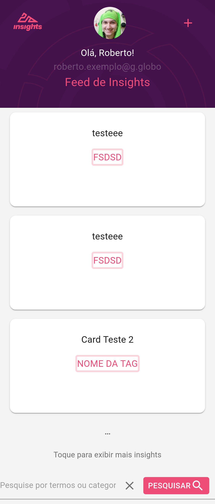
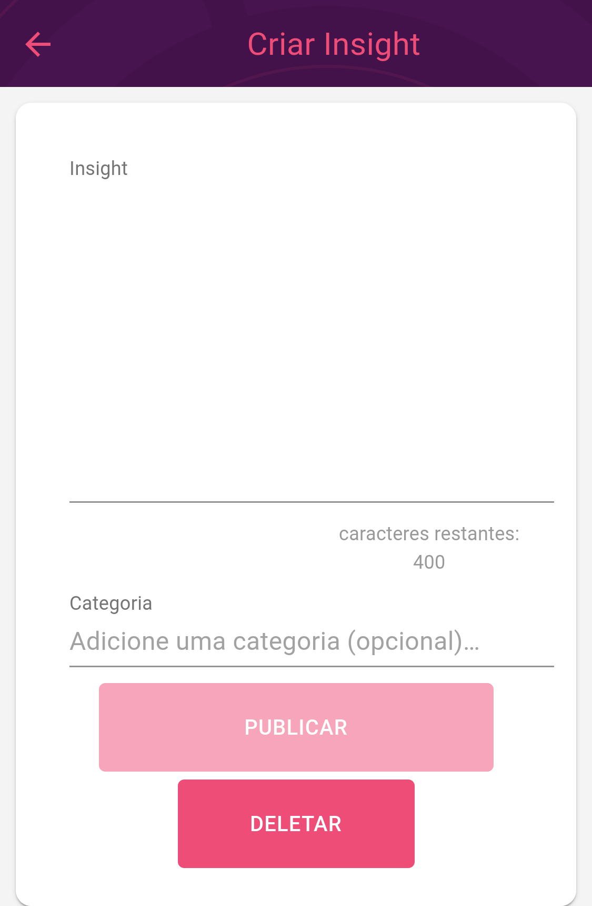
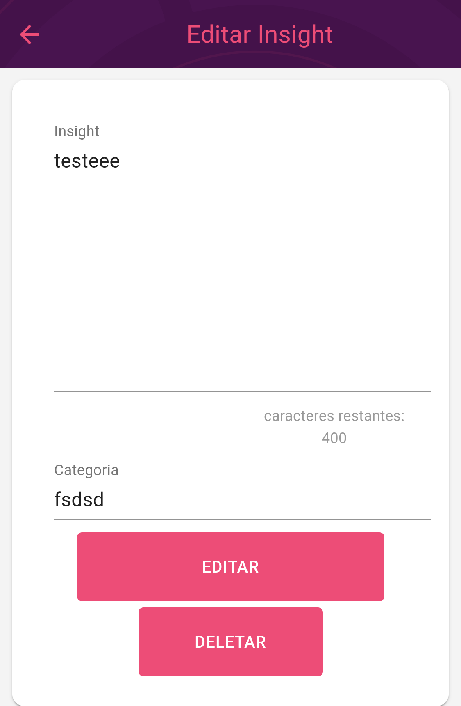
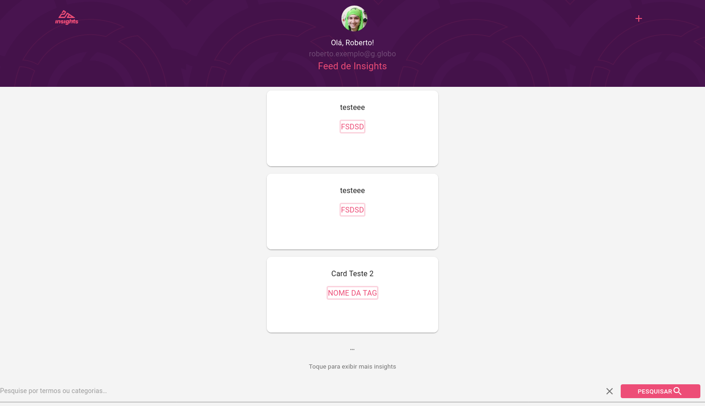
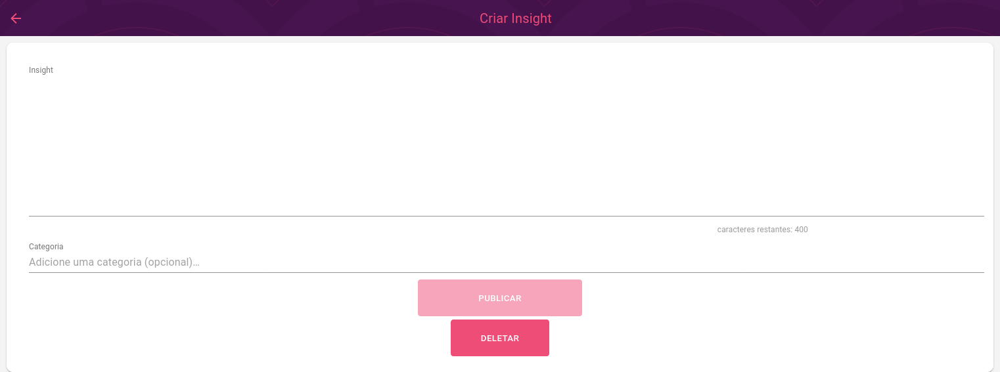
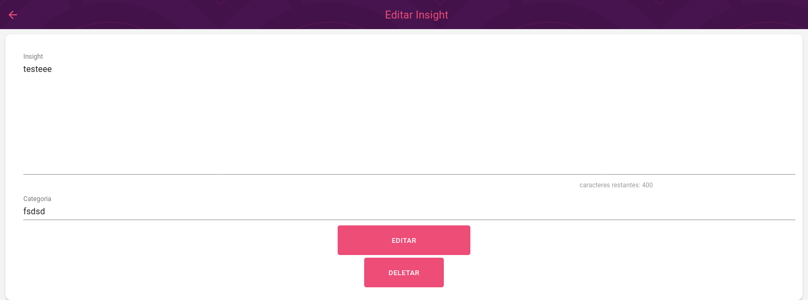

# Interface Globocard

Esse projeto é uma interface gráfica desenvolvida com ReactJS e Material-UI para ser utilizada em conjunto com a Api GloboCard. Com objetivo de facilitar o processo de criação de Cards esportivos(Insights) para o desafio Globo. Sendo possível criar, deletar e atualizar e procurar Cards por Tags. Esse projeto está hospedado no Vercel e utilizando o método de deploy automático. Você pode acessar esse projeto hospedado no Vercel em [clique aqui](https://interface-globo-card-desafio.vercel.app/). É necessário aguardar até que o Heroku(Nuvem onde a api se encontra hospedada) responda.

## Requerimentos:

- NodeJS
- ReactJS > 14.x

## Bibliotecas utilizadas:

- react-redux
- Reach/router
- Material-UI
- ReduxThunk

## Telas responsivas para dispositivos móveis e computadores.

- Tela para exibir cards em dispositivos móveis.

- Tela para criar cards em dispositivos móveis.

- Tela para editar cards em dispositivos móveis.

- Tela para exibir cards em computadores.

- Tela para criar cards em computadores.

- Tela para editar cards em computadores.

## Primeiros passos(padrão)
1. Clone esse repositório em um local de fácil localização
2. Acesse a pasta raíz do projeto clonado.
3. Abra um terminal na raíz do projeto.
4. Execute o comando npm install
5. Aguarde o procedimento de instação das dependências
6. Crie um arquivo .env na raíz do projeto e adicione as seguintes linhas:

        PORT=3000
        REACT_APP_API=http://127.0.0.1:5000

6. Ainda no terminal, execute o comando npm start
7. Aguarde o processo de inicialização e espere seu navegador ser aberto com o projeto.

## Primeiros passos(docker)
1. Clone esse repositório em um local de fácil localização
2. Acesse a pasta raíz do projeto clonado.
3. Crie um arquivo .env na raíz do projeto e adicione as seguintes linhas:

        PORT=3000
        REACT_APP_API=http://127.0.0.1:5000

4. Abra um terminal na raíz do projeto.
5. Execute o comando docker-compose up
6. Aguarde o procedimento de inicialização do Docker.
7. Acesse a url http://127.0.0.1:5000 no seu navegador.